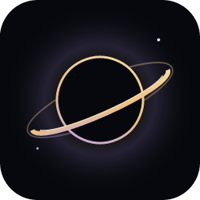

<div align="center">
  
</div>

<br />

<h1 align="center">Blackhole: Event Horizon</h1>

<p align="center">
  Near-black surfaces. Starlight syntax. A little gravity for your editor.
</p>

<div align="center">

[][marketplace]
[][changelog]
[][marketplace]
[](LICENSE)

</div>

<br />

<p align="center">
  <strong>Gold functions · Violet keywords · Cyan variables · Optional audio visualization</strong>
</p>

<p align="center">
  Created by <a href="https://github.com/blink616">Hamiz Ali</a> · Publisher <code>blankmax</code>
</p>

<br />

---

## About

Blackhole: Event Horizon is a dark color theme for Visual Studio Code, inspired by the light around a black hole. Near-black panels frame a cool editor surface, while warm gold, soft violet, and icy blue give your code its structure.

- **A coordinated workspace:** editor, sidebar, terminal, Git diffs, and diagnostics share one palette.
- **Distinct syntax colors:** functions, keywords, types, variables, and strings each have their place.
- **Semantic highlighting:** TextMate scopes and semantic tokens work together with your language extensions.
- **Contrast checked:** base syntax foregrounds meet at least 4.5:1 against the editor background.
- **Lightweight:** the theme contains no runtime code, production dependencies, telemetry, or network requests.
- **Free and open source:** MIT licensed, with editable TypeScript sources.

<br />

## Table of Contents

- [About](#about)
- [Easy Installation](#easy-installation)
- [Alternate Installation](#alternate-installation)
- [Recommended Settings](#recommended-settings)
- [Horizon Pulse](#horizon-pulse)
- [Color Palette Reference](#color-palette-reference)
- [Frequently Asked Questions](#frequently-asked-questions)
- [Feedback and Contributions](#feedback-and-contributions)
- [Development](#development)
- [About the Creator](#about-the-creator)
- [License](#license)

<br />

---

## Easy Installation

1. Open the **Extensions** sidebar with <kbd>Cmd</kbd> + <kbd>Shift</kbd> + <kbd>X</kbd> on macOS, or <kbd>Ctrl</kbd> + <kbd>Shift</kbd> + <kbd>X</kbd> on Windows/Linux.
2. Search for **Blackhole: Event Horizon** by **blankmax**.
3. Click **Install**.
4. Open the Command Palette and run **Preferences: Color Theme**.
5. Select **Blackhole: Event Horizon**.

Requires **VS Code 1.85.0 or later**. The theme works on macOS, Windows, and Linux.

<br />

## Alternate Installation

Open Quick Open with <kbd>Cmd</kbd> + <kbd>P</kbd> on macOS or <kbd>Ctrl</kbd> + <kbd>P</kbd> on Windows/Linux, then paste:

```text
ext install blankmax.darkroom-theme
```

Or install from your terminal:

```sh
code --install-extension blankmax.darkroom-theme
```

For a downloaded `.vsix` file, run **Extensions: Install from VSIX…** from the Command Palette. After installation, select **Blackhole: Event Horizon** through **Preferences: Color Theme**.

<br />

## Recommended Settings

The theme works with your existing editor setup. To select it and explicitly enable semantic highlighting, add these optional settings to your `settings.json`:

```json
{
  "workbench.colorTheme": "Blackhole: Event Horizon",
  "editor.semanticHighlighting.enabled": true
}
```

Keep your preferred font, icon theme, and editor layout. No additional extension is required.

<br />

---

## Horizon Pulse

<p align="center">
  
</p>

<p align="center">
  <strong>A black hole that moves with your music.</strong>
</p>

[Horizon Pulse][pulse] is a separate, optional companion extension. A gold accretion disk responds to bass, violet light follows the midrange, and particles react to treble inside VS Code's bottom panel.

- A single **Start capture / Stop capture** button.
- Response fixed at **2.5×**.
- System reduced-motion preferences respected.
- Capture stops when the visualizer is hidden or closed.
- Local system-audio processing, with no microphone access, recordings, or uploads.

Live capture requires **macOS 14.2 or later**. The theme works independently on all supported platforms.

[Explore Horizon Pulse →][pulse]

[Install Horizon Pulse from the VS Code Marketplace][pulse-marketplace]

<br />

## Color Palette Reference

| Role                     | Color     | Character      |
| ------------------------ | --------- | -------------- |
| Title and status bars    | `#07080d` | Outer space    |
| Sidebar and terminal     | `#0b0d14` | Deep space     |
| Editor background        | `#10121c` | Midnight       |
| Editor text              | `#dce1ef` | Starlight      |
| Functions and cursor     | `#edc182` | Accretion gold |
| Keywords                 | `#b9a0f7` | Violet         |
| Types and classes        | `#9dbfe9` | Ice            |
| Variables and parameters | `#95d2d5` | Cyan           |
| Properties and keys      | `#d6b3d1` | Nebula         |
| Strings                  | `#b8caa0` | Dust           |
| Numbers and constants    | `#e4a3b5` | Redshift       |
| Comments                 | `#7f8aa5` | Distant light  |

<br />

---

## Frequently Asked Questions

### Does it work with my programming language?

Blackhole styles TextMate scopes and semantic token types supplied by VS Code and your language extensions. Exact highlighting depends on the language and its extension. If something looks wrong, [open an issue][issues] with a small code sample.

### Do I need a special font or icon pack?

No. Blackhole works with your existing font and icon theme.

### Does the theme react to music?

The optional **Horizon Pulse** extension provides the audio visualization. Your editor's syntax colors stay stable, and the theme does not access audio.

### Is the theme accessible?

Automated checks verify at least **4.5:1 contrast** for base syntax foregrounds against the editor background, including comments. This is a targeted check; selections, overlays, and extension-provided interfaces can affect contrast.

### Can I customize the colors?

Yes. VS Code's `workbench.colorCustomizations` and `editor.tokenColorCustomizations` settings let you override individual colors. For source changes, edit the TypeScript files in `src/` and rebuild.

<br />

## Feedback and Contributions

Found a highlighting issue or have an idea? [Open an issue][issues] or contribute on [GitHub][repository]. Include your VS Code version, language extension, and a short code sample or screenshot when reporting a visual problem.

<br />

## Development

Use **Node.js 22 or later** and **pnpm 10.31.0**.

```sh
pnpm install --frozen-lockfile
pnpm build
pnpm check
pnpm package
```

The TypeScript sources in `src/` generate the theme JSON, icon, and README banner. Commit the generated files alongside their sources. Use `pnpm watch` while editing, then select **Preview Event Horizon** in Run and Debug to launch the development host.

`pnpm package` creates a VSIX in `dist/`, containing only the manifest, theme, images, README, changelog, and license. For the visualizer, see the [Horizon Pulse development instructions][pulse-development].

<br />

## About the Creator

Created and maintained by **Hamiz Ali**, published as **blankmax**.

[GitHub][creator] · [Source code][repository] · [Changelog][changelog]

<br />

## License

[MIT](LICENSE) · Copyright © 2026 Hamiz Ali

<br />

<p align="center">
  Made by <a href="https://github.com/blink616">Hamiz Ali</a> · Inspired by the event horizon.
</p>

[repository]: https://github.com/blink616/event-horizon-vscode
[marketplace]: https://marketplace.visualstudio.com/items?itemName=blankmax.darkroom-theme
[issues]: https://github.com/blink616/event-horizon-vscode/issues
[creator]: https://github.com/blink616
[changelog]: https://github.com/blink616/event-horizon-vscode/blob/main/CHANGELOG.md
[pulse]: https://github.com/blink616/event-horizon-vscode/tree/main/companion#readme
[pulse-marketplace]: https://marketplace.visualstudio.com/items?itemName=blankmax.horizon-pulse
[pulse-development]: https://github.com/blink616/event-horizon-vscode/tree/main/companion#development
